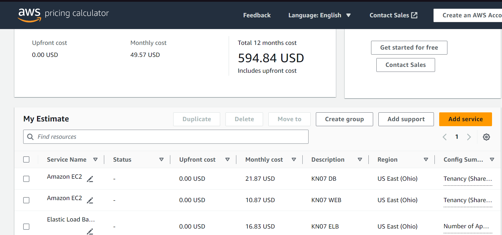
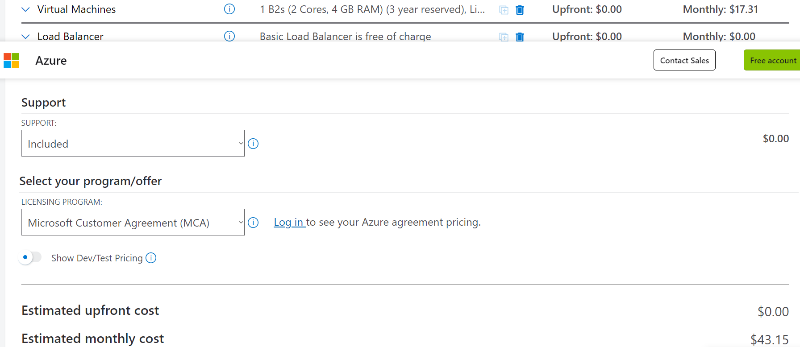

A) Kostenrechnung erstellen
Rehosting

AWS:

Azure

Vergleich:
Einfachheit: Azure punktet mit einer benutzerfreundlichen Oberfläche und guter Integration in Microsoft-Technologien.
Erfahrung: Da ich jedoch bereits erfahrung mit AWS habe, ist AWS einfacher für mich zu Bedienen.
Automatisierung: Beide Plattformen bieten Tools zur Automatisierung von Ressourcenbereitstellung und -verwaltung.
Fazit:
Aufgrund meiner Erfahrung und der möglichen Kostenvorteile würde ich mich für AWS entscheiden. Die Plattform bietet vergleichbare Dienst, jedoch ist es am Anfang nicht sehr benutzerfreundlich.

Replatforming:
