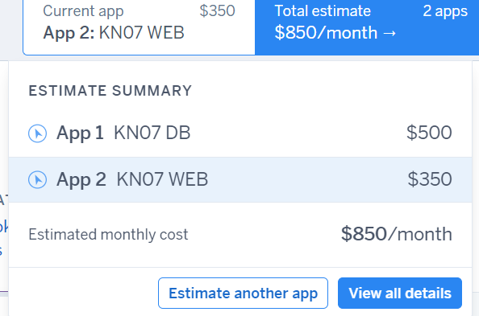
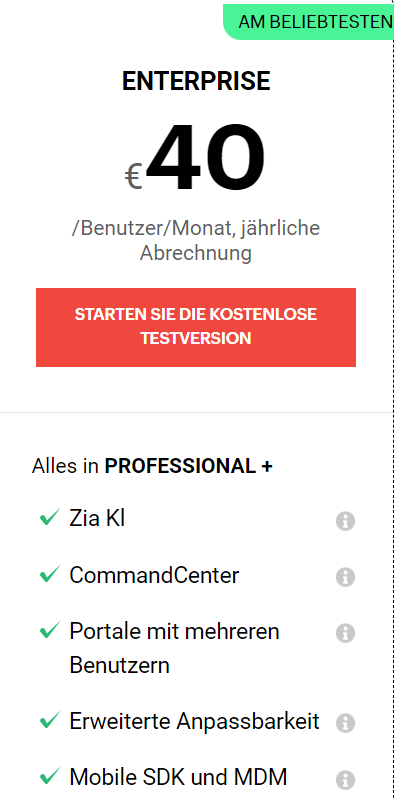
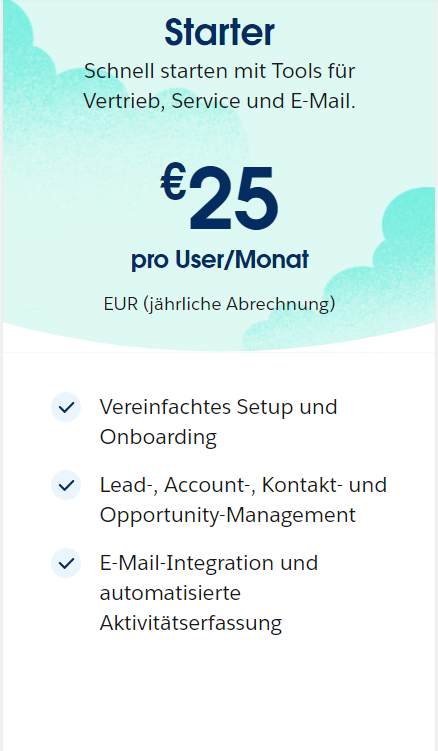

A) Kostenrechnung erstellen
Rehosting

AWS:

Azure
!

Vergleich:
Einfachheit: Azure punktet mit einer benutzerfreundlichen Oberfläche und guter Integration in Microsoft-Technologien.
Erfahrung: Da ich jedoch bereits erfahrung mit AWS habe, ist AWS einfacher für mich zu Bedienen.
Automatisierung: Beide Plattformen bieten Tools zur Automatisierung von Ressourcenbereitstellung und -verwaltung.
Fazit:
Aufgrund meiner Erfahrung und der möglichen Kostenvorteile würde ich mich für AWS entscheiden. Die Plattform bietet vergleichbare Dienst, jedoch ist es am Anfang nicht sehr benutzerfreundlich.

Replatforming:

Heruko:

Erklärung der Auswahl:

Repurchasing: 

Zoho CRM:

Salesforce:

Auswahl:

Ich habe mich für Zoho entschieden, da Zoho preisleistung besser ist, da man genau weiss, was man für den Preis bekommt, was bei salesforce nicht so ist. Bie Zoho bekommt man für den Preis viel mehr angeboten.