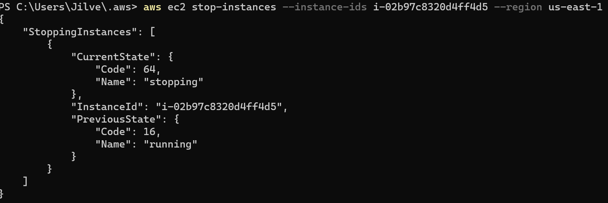
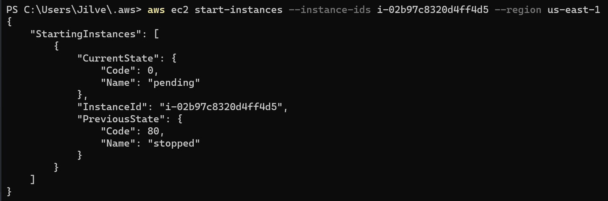
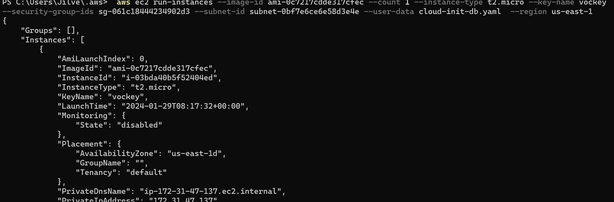
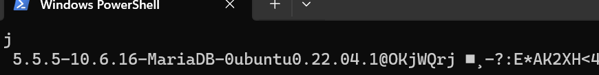

```bash
  aws ec2 stop-instances --instance-ids i-02b97c8320d4ff4d5 --region us-east-1
 ```



```bash
 aws ec2 start-instances --instance-ids i-02b97c8320d4ff4d5 --region us-east-1
 ```

 

```bash
aws ec2 run-instances --image-id ami-0c7217cdde317cfec --count 1 --instance-type t2.micro --key-name Lorena-1 --security-group-ids sg-061c18444234902d3 --subnet-id subnet-0bf7e6ce6e58d3e4e --user-data file://C:/Work/alleordner/TBZ/m320/m346/KN05/cloud-init-db.yaml  --region us-east-1

 ```

 

```

``` 